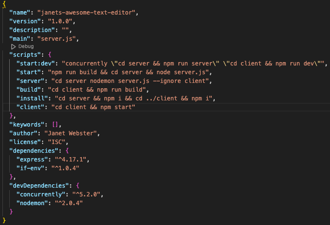
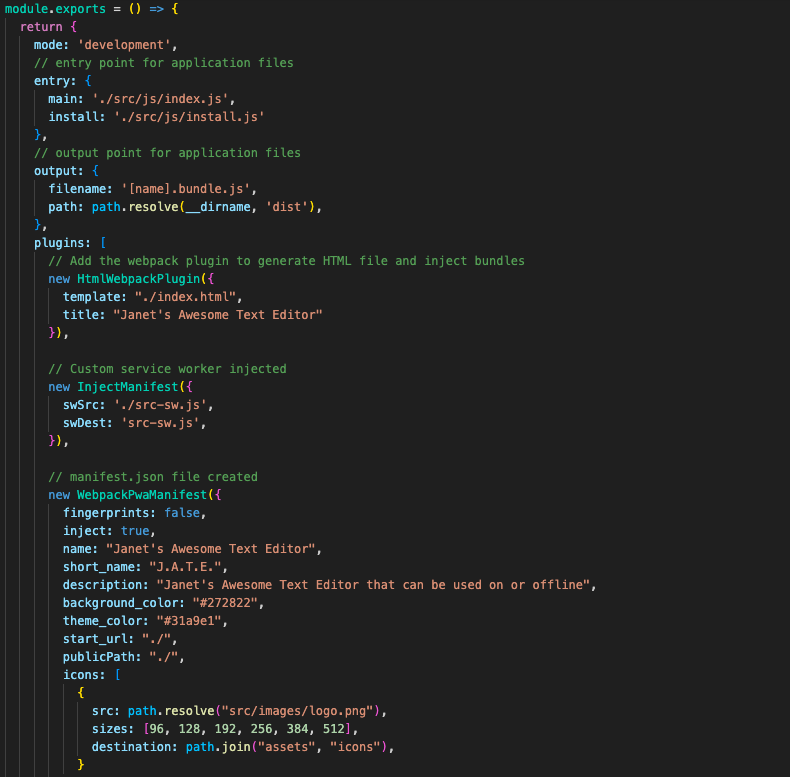
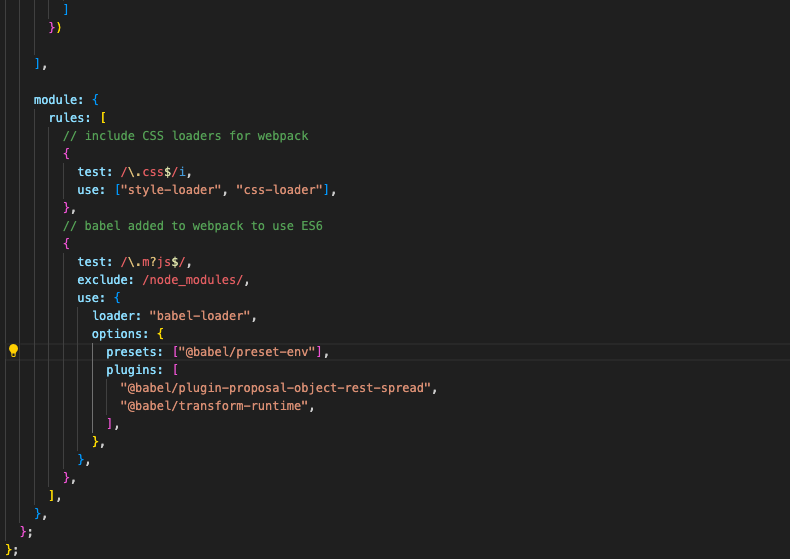
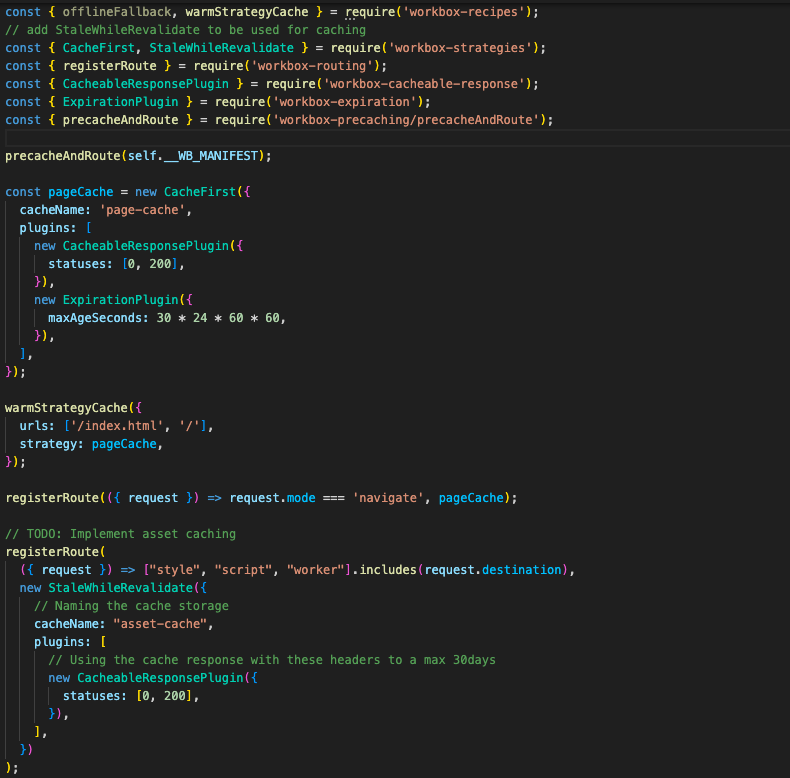
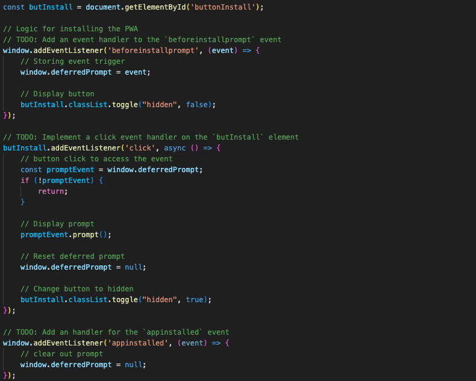

# (づ ◕‿◕ )づ JANET'S AWESOME TEXT EDITOR ٩(◕‿◕)۶
_AKA, JATE_

### [View Live Project Here](https://drive.google.com/file/d/17xN02lGkRAIHOotqJwAM4zFbD0m237cd/view?usp=sharing "TEXT EDITOR")<br />

| Technology Used    | Resource URL |
| --------  | ------- |
| NodeJS | https://nodejs.org/en |
| ExpressJS | https://expressjs.com/ |
| path | https://www.npmjs.com/package/path |
| concurrently | https://www.npmjs.com/package/concurrently |
| IndexedDB | https://www.npmjs.com/package/idb |
| Nodemon  | https://www.npmjs.com/package/nodemon |
| Webpack | https://www.npmjs.com/package/webpack |
| @babel | https://www.npmjs.com/package/@babel/core |
| JavaScript | https://developer.mozilla.org/en-US/docs/Web/JavaScript |
| Git       | https://git-scm.com/ |
| GitHub     | https://github.com/ |
| VSCode    | https://code.visualstudio.com/ |

## Table of Contents

* [Description](#description)
* [Installation](#installation)
* [Usage](#usage)
* [License](#license)
* [About](#about)

## Description:
This project is a on and off-line text editor application. Using Progressive Web Applications to build a text editor that runs in the browser.<br />
<br />

### How to use this app:

* Be sure to have the technologies above
* Download this repository to your local device
* Run `npm i && npm run seed`
* Run `npm start`
* Watch the video above on how to run routes in Insomnia
* View, add, update, and remove data as needed

  ## User Story

```md
AS A social media startup
I WANT an API for my social network that uses a NoSQL database
SO THAT my website can handle large amounts of unstructured data
```

## Acceptance Criteria

```md
GIVEN a social network API
WHEN I enter the command to invoke the application
THEN my server is started and the Mongoose models are synced to the MongoDB database
WHEN I open API GET routes in Insomnia for users and thoughts
THEN the data for each of these routes is displayed in a formatted JSON
WHEN I test API POST, PUT, and DELETE routes in Insomnia
THEN I am able to successfully create, update, and delete users and thoughts in my database
WHEN I test API POST and DELETE routes in Insomnia
THEN I am able to successfully create and delete reactions to thoughts and add and remove friends to a user’s friend list
```

### MongoDB/Mongoose Lessons Learned 

#### 1. Controllers versus Routes
I probably should have picked up on this difference before this project, but here we really iron out the separation. Routes and controllers play distinct roles in handling incoming requests and generating appropriate responses. Routes define the pathways for incoming requests, while controllers manage the the application's logic and interctions with the database, ultimately generating the appropriate response to user interactions. I want to delve further into this in the other lessons.
<br />


#### 2. Controllers
Controllers handle the application's business logic, processing requests from the routes and generating responses. They interact with the database to retrieve or manipulate data, perform calculations, and prepare the necessary information to be sent back to the user. Controllers orchestrate the application's logic, ensuring that requests are handled efficiently and according to the application's requirements. Here are a couple examples of the controllers used for this project.
<br />




#### 3. Routes
Routes act as a map for directing incoming requests to specific controller functions. They define the endpoints or URLs that a web application can respond to. When a user interacts with the application by accessing a particular URL, the corresponding route matches the URL pattern and directs the request to the appropriate controller action. Here is an example of the routes using the controllers.
<br />


#### 4. Helpers => dateFormat && seed
For this project I used helpers to set the date/time format and to seed the database. For the dateFormat the ultimate goal was to create a readable timestamp for Thoughts and Reactions in the database. Here is a sample of the code used to implement it.
<br />


<br />
For the seed file, I wanted to have data already in the system so the entries did not have to be added manually to the database.
<br />


#### Synopsis
Sometimes learning new technologies can be just as challenging as learning a concept enveloped in a particular tech. The hangups that I found really came down to not knowing how to write the syntax for the new tech and trying to rely on knowledge of other techs already learned. This required research to make sure syntax was typed specifically to working with MongoDB and Mongoose.

## Installation

1. Create a new repository on GitHub, to store this project.
2. Clone the repository to your computer.
3. Copy files to your own repository.
4. Follow the steps for "How to" above
5. Make changes to the code.
6. Commit the changes to the local repo.
7. Push the changes to the remote repo.

## Usage

This is a back end social media api project. If you would like to update and use app follow the installation steps and curate it to your needs. If you would like to use this app, follow the steps under the description 'How to' above and click the link at the top of this page.

## License

MIT License
Copyright (c) 2023 Twixmixy / Janet Webster

<hr />

## About
### Janet Webster
Full Stack MERN Software Engineer in training.

- [GitHub](https://github.com/TwixmixyJanet/)
- [LinkedIn](https://www.linkedin.com/in/twixmixy/)
- [Twitter](https://twitter.com/Twixmixy)
- [WakaTime](https://wakatime.com/@Twixmixy)


<br /><br /><br /><br /><br /><br /><br /><br /><br /><br /><br /><br /><br /><br /><br /><br /><br /><br /><br /><br /><br /><br /><br /><br /><br /><br /><br /><br /><br /><br /><br /><br /><br /><br /><br /><br /><br /><br /><br /><br /><br /><br /><br /><br /><br /><br /><br /><br /><br /><br /><br /><br /><br /><br /><br /><br /><br /><br /><br /><br /><br /><br />

Did you really read down this far? Gold star for you! ⭐
```
You have received 5+ points in being EXTRA
```